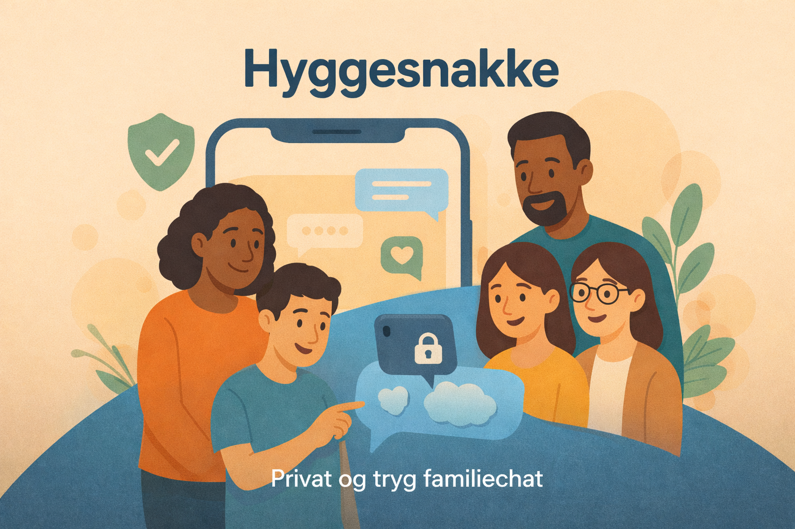

# Hyggesnak

💬 A chat app for friends and families focusing on privacy, security and to keep you close to the ones who matters and not meta or other big tech companies 💬

Do you wabnt to test it out? Well you can:

## How to run locally  

1. Clone the repo: `git clone https://github.com/danskode/hyggesnak.git`
2. `cd client`
3. `npm i`
4. `cd ..`
5. `cd server`
6. `npm i`
7. Setup an .env file guided by the .env.local key value pairs in the server folder
8. Run `node server/database/seed.js` to add sqlite database and dummy data into users table
9. You are ready to join the Hulen: Run the command `npm run dev` or `npm rund dev:client` if you just want to run the client side from the root folder and concurrently and the script will take care of starting both **client** and **server**.

💬💬💬💬💬💬💬💬💬💬💬💬💬💬💬💬💬💬💬💬💬💬💬💬💬💬💬💬